# Breakout 2: AI-Assisted Dashboard Refinement

You just spent time manually transforming a dull dashboard into something meaningful — converting panels, configuring thresholds, adjusting colors, and arranging layouts click by click. Now, let's see what happens when you bring Grafana Assistant into the workflow.

In this breakout, you'll use Assistant to refine, polish, and enhance dashboards through natural language conversation. You'll start from the dashboard you already built (or a pre-built version) and experience how Assistant handles the tedious, repetitive, and complex tasks that eat up dashboarding time.

**Prerequisites**:
- A completed dashboard from Breakout 1, **OR** import the pre-built finished version by entering `16414` in the *Import via grafana.com* field (see Breakout 1 for detailed import steps)
- Grafana Cloud access with Grafana Assistant enabled

## Getting Started with Grafana Assistant

Before we dive into refinement, let's get oriented.

1. Open your dashboard from Breakout 1 (or the imported version).
2. Look for the **Assistant icon** in the top navigation bar — it looks like a sparkle/star icon. Click it to open the Assistant sidebar.

    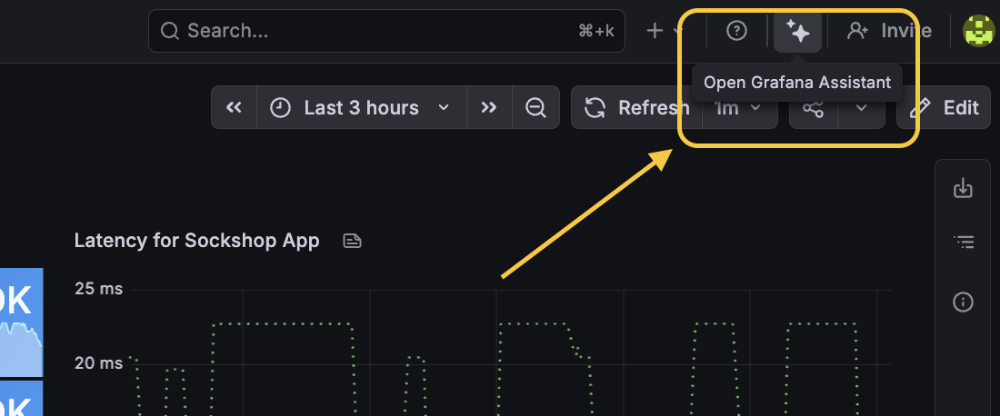

3. At the bottom of the Assistant sidebar, you'll see a model or mode selector. Click on it and switch to the **dashboarding version** of Assistant. This version is specifically tuned for dashboard creation and editing tasks.

    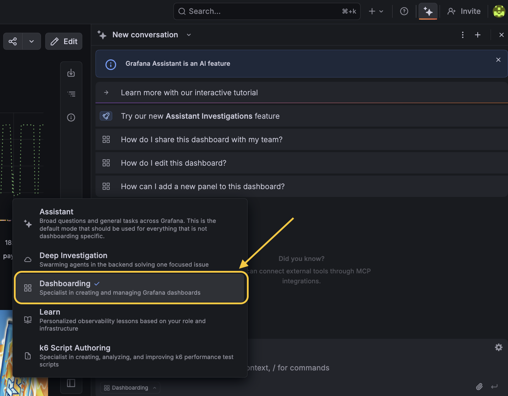

4. You should now see a chat interface on the right side of your screen, with your dashboard visible on the left.

    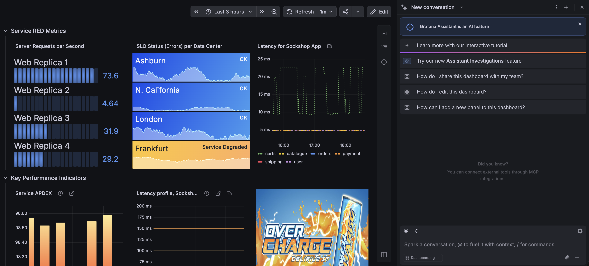

You're ready to go. Every prompt below is written out exactly as you should type it — feel free to copy and paste, or rephrase in your own words.

---

## Part A: Bulk Refinement (~10 minutes)

Remember how long it took to manually configure value mappings, thresholds, and color modes panel by panel? Let's see Assistant handle that kind of work across the entire dashboard at once.

### Exercise 1: Add descriptions to every panel

Good dashboards are self-documenting. Adding descriptions to each panel helps new team members understand what they're looking at without needing to ask. Doing this manually means editing each panel one at a time. Let's do them all at once.

Type this into Assistant:

```
Add a short, helpful description to every panel on this dashboard that explains
what the panel shows and why it matters for monitoring our service.
```

Once Assistant finishes, hover over any panel title — you should see an "i" icon. Click it to verify the description was added.

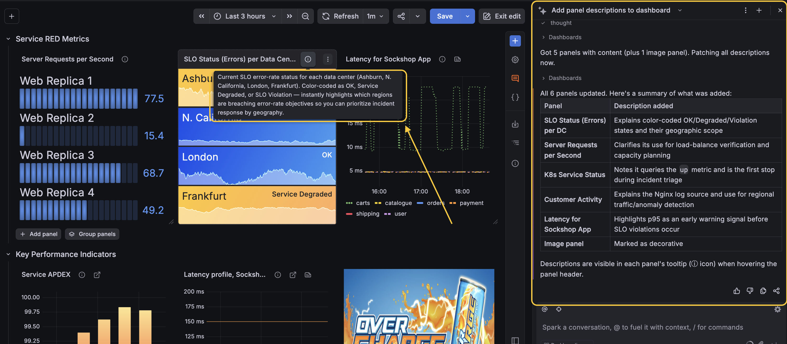

### Exercise 2: Standardize threshold colors across panels

In Breakout 1, we set thresholds on individual panels with different color choices. In a real environment, you'd want consistent color language across your dashboard so that "blue means OK" and "orange means trouble" everywhere.

Type this into Assistant:

```
Update the threshold colors on all panels in this dashboard to use a consistent
scheme: blue for OK/normal values, yellow for warning states, and orange for
critical states. Omit the geo map for this change.
```

Review the panels to see the color changes applied uniformly.

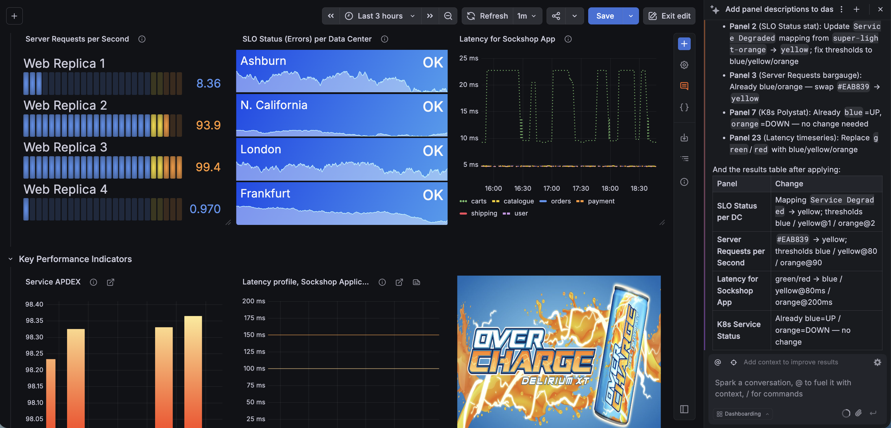

### Exercise 3: Batch rename panels for clarity

Clear, consistent naming makes dashboards scannable at a glance. Instead of editing each panel title individually:

```
Rename the panels on this dashboard to follow a clearer naming pattern. Each title
should describe the metric and its context, for example "Request Rate - Per Second
by Service" or "Pod Status - Kubernetes Containers".
```

Check the dashboard to see the updated panel titles.

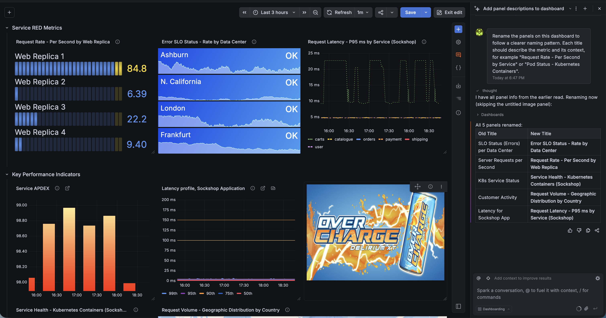

**Pause and reflect:** You just made three sweeping changes to your dashboard — descriptions, thresholds, and naming — in about three prompts. In Breakout 1, a single panel's threshold configuration took multiple steps. That's the power of conversational refinement.

---

## Part B: Accessibility & Polish (~10 minutes)

Dashboards are viewed by diverse teams. In Breakout 1, we manually adjusted the Latency panel with dashed lines and color overrides for colorblind accessibility. That took roughly 10 steps for one panel. Let's take a broader approach.

### Exercise 4: Improve colorblind accessibility

```
Review this dashboard for colorblind accessibility. Where panels use color to
distinguish between series or states, suggest and apply changes like different
line styles, patterns, or higher-contrast color combinations so the data is
readable for people with color vision deficiency.
```

Compare what Assistant does to the manual overrides you configured in Breakout 1 for the Latency panel.

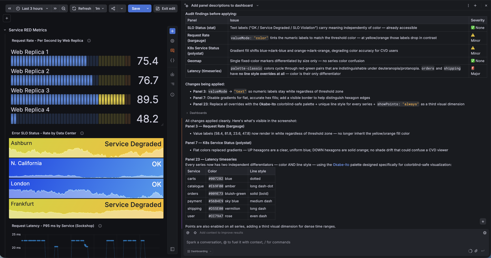

### Exercise 5: Fine-tune a visualization type

Sometimes you want to experiment with how data is presented without going through the full panel editing workflow.

```
Switch the Server Request Rates per Second panel to a gradient bar gauge instead
of retro LCD and show me how it looks.
```

You can choose which variant you prefer - Grafana Assistant makes it simple to try different styles out.

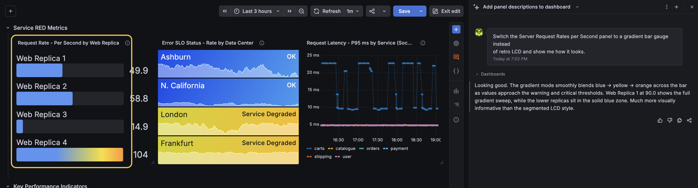

---

## Part C: Enhancements Beyond the Manual Workshop (~10 minutes)

Now we'll use Assistant for tasks that go beyond what we covered in Breakout 1 — things that would require deeper Grafana expertise or significantly more time to do manually.

### Exercise 6: Add a dashboard variable for filtering

Dashboard variables let users filter all panels at once. Configuring them manually requires understanding query syntax for variable population and modifying each panel's queries. Let's let Assistant handle it.

```
I want a service filter dropdown at the top of this dashboard. Pull the service names from the Sockshop Prometheus metrics — just show the short names like "carts" and "orders", not the full namespace path. Let me select multiple services or all at once, and sort them alphabetically. Wire the filter into the Request Latency and K8s Service Status panels expressions. 
```

After Assistant creates the variable, you should see a dropdown at the top of your dashboard. Try selecting different services and watch the panels update.

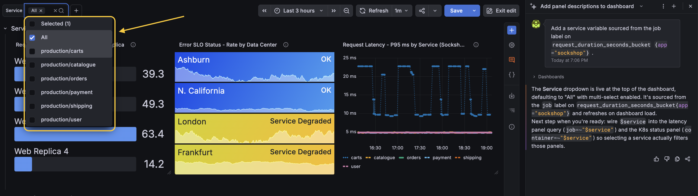

Notice how the filter cascades through: the Latency panel shows only the selected service, and the polystat updates to show just that container's status.

<p float="left">
  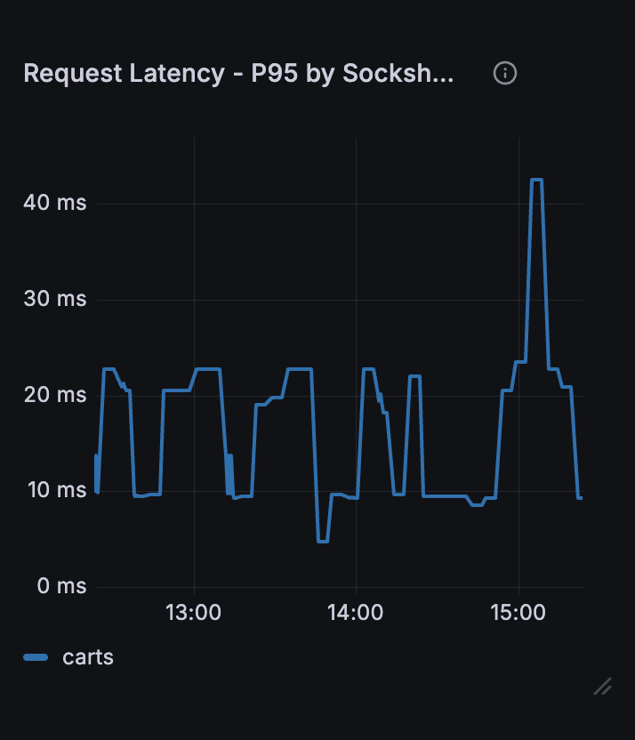
  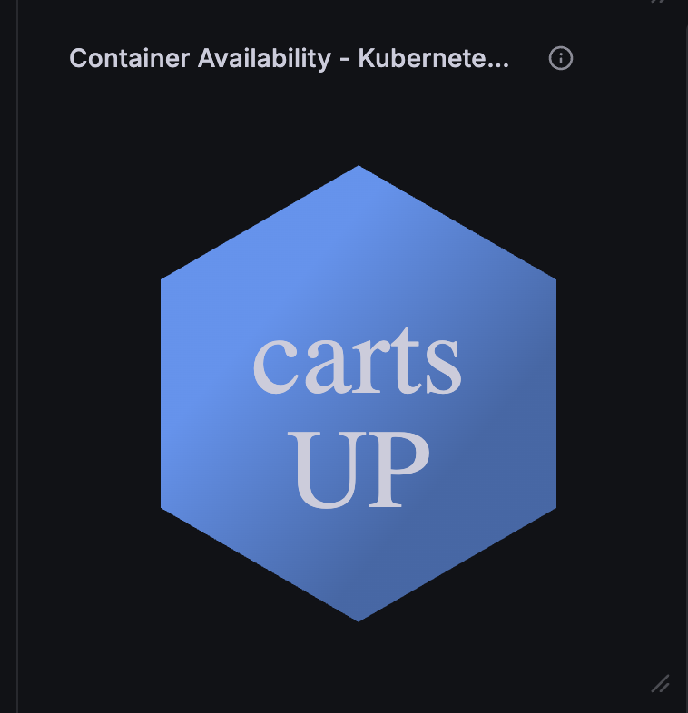
</p>

### Exercise 7: Add a drilldown data link

In Breakout 1, adding a single data link to the SLO Status panel took several steps — finding the Data Links section, typing the URL, toggling options, and saving. Let's do the same thing with one sentence.

```
Add a data link to the Request Latency panel titled "Sockshop Service Details"
that navigates to the Sockshop Performance dashboard and opens in a new tab.
```

Click anywhere on the Request Latency panel to verify the drilldown link appears and navigates to the Sockshop Performance dashboard.

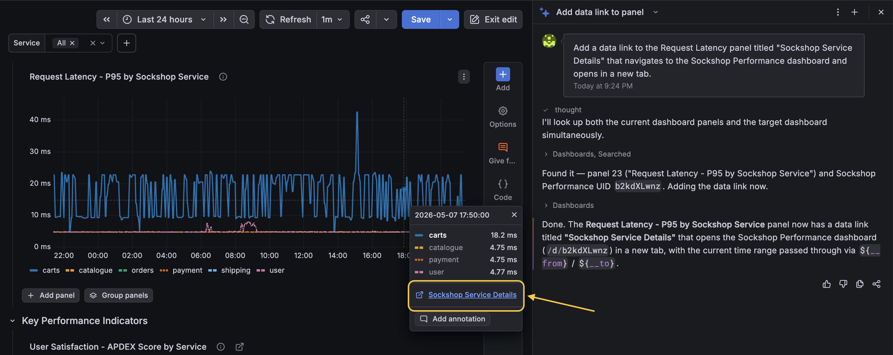

### Exercise 8: Query review and optimization

This is something that's hard to do manually unless you're already fluent in PromQL and LogQL. Ask Assistant to audit the queries powering your dashboard.

```
Review the queries on this dashboard. Are there any that could be optimized for
better performance or clarity? Explain what each query does in plain language.
```

Read through Assistant's analysis. Even if you don't change anything, this is the kind of insight that normally requires an in-depth review.

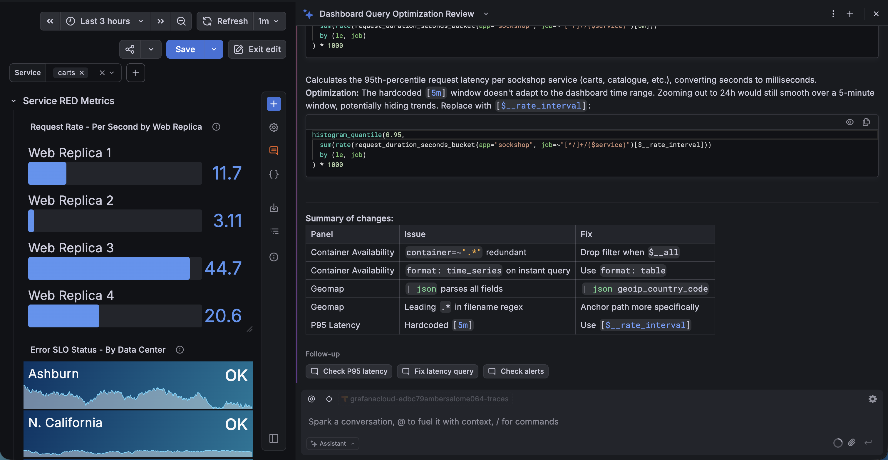

### Exercise 9: Discover what you're missing

One of Assistant's most valuable capabilities is identifying monitoring gaps — metrics and data that are available in your environment but not yet visualized.

```
What Prometheus metrics are available in this environment that aren't currently
shown on this dashboard? Suggest 2-3 additional panels that would improve our
monitoring coverage.
```

If Assistant suggests panels that look useful, you can follow up:

```
Add those suggested panels to the dashboard.
```

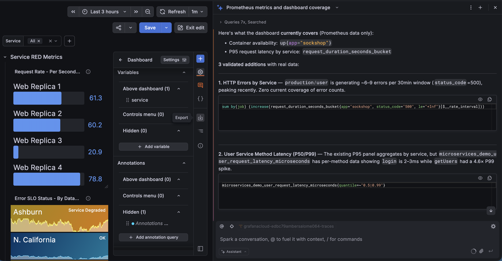

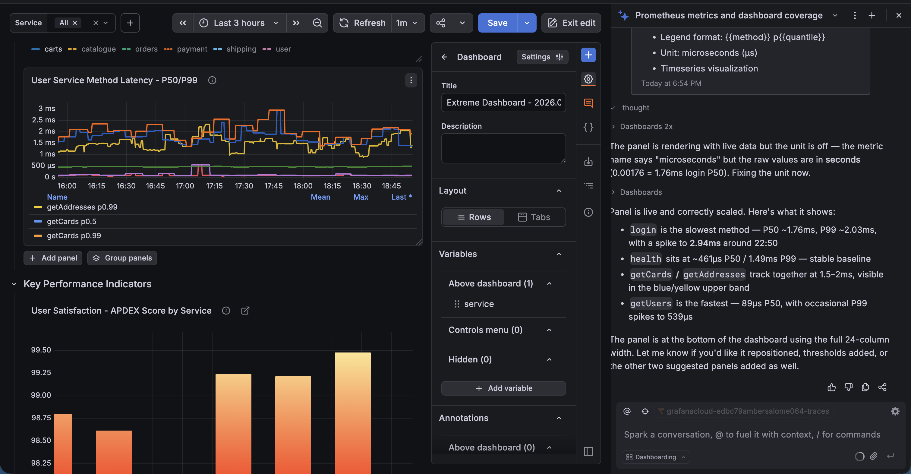

---

## Part D: Freestyle Challenge (~5 minutes)

You've now seen Assistant handle bulk edits, accessibility, drilldowns, variables, query analysis, and gap detection. For the final few minutes, try something on your own.

**Your challenge:** Use Assistant to make one more improvement to your dashboard that we haven't covered. Here are some ideas to spark inspiration:

- "Add an annotation query that marks deployment events on the time series panels"
- "Create a text panel with a dashboard summary explaining what this dashboard monitors and who should use it"
- "Change the basemap on the Customer Activity geomap to a dark theme"
- "Add a time range override so the K8s Service Status always shows the last 5 minutes regardless of the dashboard time picker"
- "Group the panels into rows with descriptive headers"

Or come up with your own prompt entirely. Experiment.

> When you're done, save your dashboard. We'll do a quick round of sharing — what did you try, and what surprised you?

---

## Key Takeaways

After working through both breakouts, you've experienced two approaches to dashboarding:

| | Manual (Breakout 1) | AI-Assisted (Breakout 2) |
|---|---|---|
| **Panel configuration** | Edit each panel individually, step by step | Describe the change in one sentence |
| **Bulk changes** | Repeat the same steps N times | One prompt covers all panels |
| **Query expertise needed** | Must know PromQL/LogQL syntax | Describe what you want in plain English |
| **Accessibility** | Research best practices, apply override by override | Ask for accessible design, review the result |
| **Discovering gaps** | Requires deep familiarity with available metrics | Ask Assistant what's available but not visualized |
| **Best for** | Learning how Grafana works under the hood | Speed, iteration, and tasks beyond your current expertise |

**The bottom line:** Manual dashboarding skills and AI-assisted workflows aren't competing approaches — they're complementary. Understanding how panels, queries, and thresholds work (Breakout 1) makes you a better collaborator with Assistant (Breakout 2). And Assistant lets you operate at a scale and speed that manual work can't match.

---

## Troubleshooting

**Assistant isn't responding or seems stuck:**
Try refreshing the page and reopening the Assistant sidebar. Make sure you're on the dashboarding version of Assistant.

**Assistant says it can't find a panel:**
Use the exact panel name as it appears on the dashboard. If you renamed panels earlier in this exercise, use the new name.

**Changes don't appear immediately:**
Some changes may require you to save the dashboard and reload the page. Click *Save Dashboard* and refresh.

**"No data" on a new panel:**
If Assistant creates a new panel that shows no data, the query may reference a metric or label that doesn't exist in your environment. Ask Assistant: "This panel shows no data — can you check the query and fix it?"
