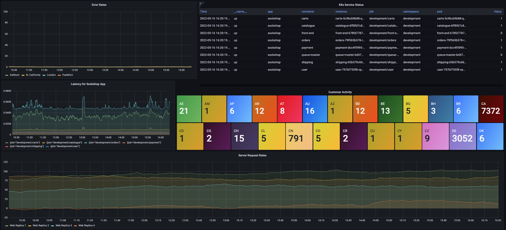
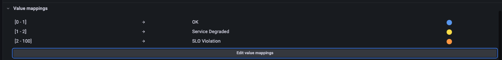
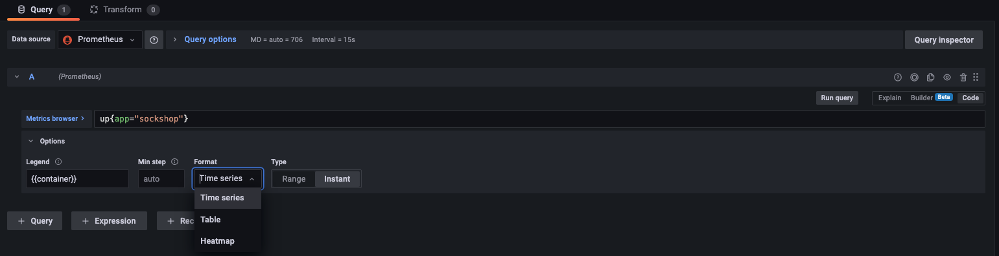
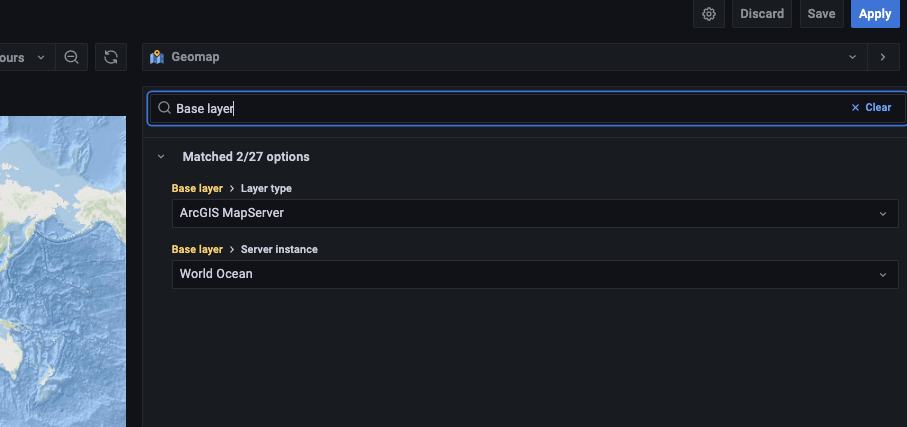
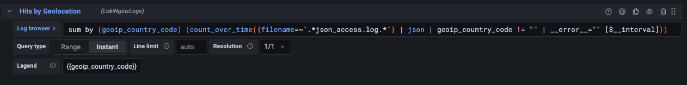
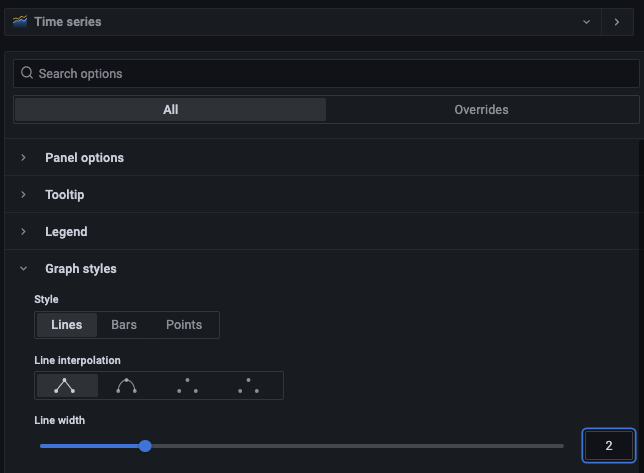
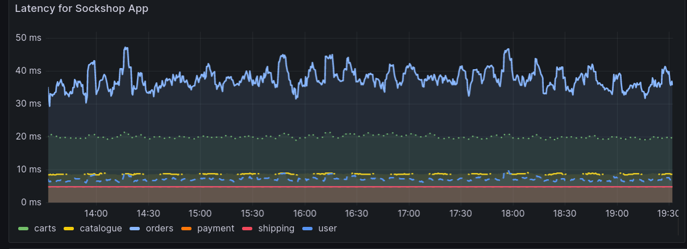
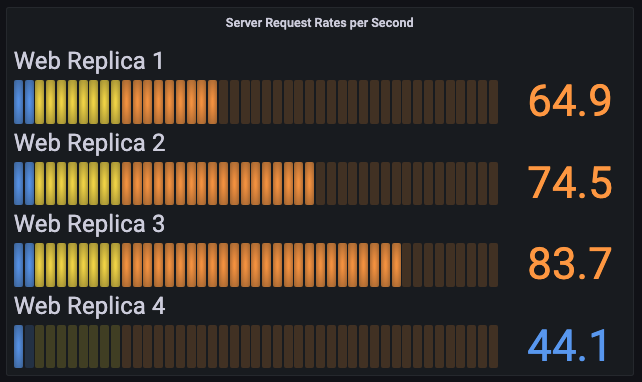
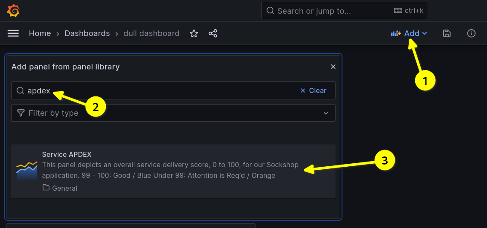
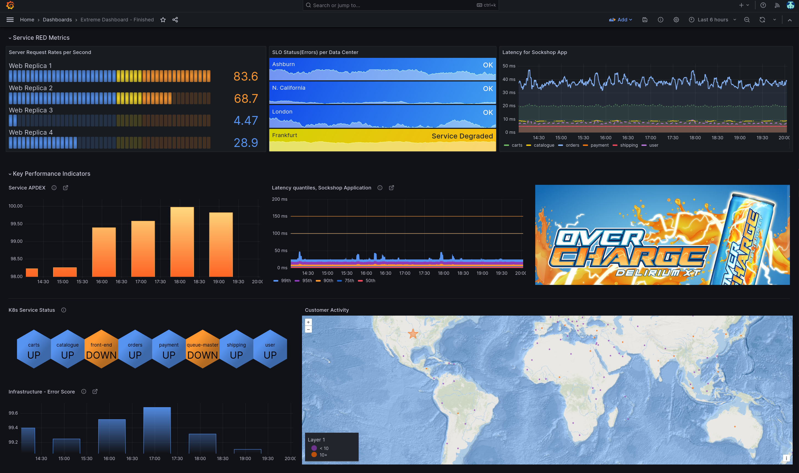

# Solo Makeover
We will be revamping the following dashboard.

**Prerequisite**: We first need to import this dashboard.
Steps to Import:
1. Go to the Dashboards (4 squares) icon in the left menu and click on **+ Import**.
2. In the Import via grafana.com field, type in `16413` and then click *Load*.
3. You will be asked to choose three of your dashboard's data sources:
  * 3a. For TestData DB, choose `TestData DB`.
  * 3b. For Prometheus (Cloud), choose `Prometheus (Cloud)`.
  * 3c. For LokiNginxLogs, choose `LokiNginxLogs`.
  * 3d. Click on *Import*.

*While our existing dashboard already has useful information such as RED metrics - request rates, errors, and duration/latency - for our service as well as state information for the underlying Kubernetes pods and end-user activity from a geographic lens, our aim is to make the information on the dashboard easier to understand and more visually appealing.*

## Convert the 'Error Rates' panel from a deprecated "graph" panel to a stat panel
We will edit the Error Rates panel first.  We want to add context to what error rates are acceptable, in a danger zone, or are in violation of an internal Service Level Objective (SLO).

1. Edit the *Error Rates* panel (click on the panel's title and then *Edit*)
2. Switch the Visualization Type from *Graph (Old)* to *Stat*
3. Under *Stat styles*:
* Change Orientation from Auto to Horizontal.
* Change Color Mode from Value to Background.
4. Expand the 'Value Mappings' section and then click *Add value mappings*
* There is a default setting that null maps to N/A. Click on *X* to remove that default.
* Click *Add a New Mapping* and then *Range*. Set range from 0 to 1 with Display Text of *OK*. Set color to Blue.
* Click *Add a New Mapping* and then *Range*. Set range from 1 to 2 with Display Text of *Service Degraded*. Set color to Yellow.
* Click *Add a New Mapping* and then *Range*. Set range from 2 to 100 with Display Text of *SLO Violation*. Set color to Orange.
* Click on Update
The value mapping settings should look like this:

5.  Change the Panel Title to *SLO Status(Errors) per Data Center*
6.  Click on *Apply*
## Convert the 'K8s Service Status' panel from a table to a polystat panel
This table is showing us tons of information that we already know.  The original goal of this table was to show a state of 1 (UP) or 0 (DOWN) for each of our service containers.   Our new goal is to simplify the presentation of the information using a *polystat* panel.
1. Edit the *K8s Service Status* panel (click on the panel's title and then *Edit*)
2. Switch the Visualization Type from *Table* to *Polystat*
* You will notice that all of the rows have been aggregated into one average of all values.  To separate our data per container, change the query's *Format* from Table to Time Series.  In newer versions of the Grafana UI, this option is under *Options*.

3. Under Options...Global on the right-hand side (5th group in the Polystat settings), change Decimals from 2 to 0 as the *Instant* value will always be a 0 or 1.
4. Change the Polygon Border Color to Transparent.
5. Under Thresholds, click on *Add Threshold*.
* For T1, leave value of 0, but change Color Mode from *ok* to *critical*.  Change the Color from Red to Orange.
* Click *Add Threshold* to add a second threshold level. A 'T2' Threshold will appear.
* For T2, set value to 1 for Color Mode *ok*.  Change the Color from Green to Blue.
7. At the bottom, click on *Add a value mapping*.
* set value of 1 to *UP*.
* add a 2nd value mapping with 0 set to *DOWN*.
8, Click Apply to the leave edit mode of that Panel.
The panel should look similar to what we have below.


## Convert the 'Customer Activity' panel from a stat panel to a geomap
This one is a mess. I've been told that this data is from OSS Loki, our logging tool, and represents the number of hits coming from each Geographic region. It is colorful, but I have a very difficult time interpreting the information.  Let's change the visualization to a map!
1. Edit the *Customer Activity* panel (click on the panel's title and then *Edit*)
2. Switch the Visualization Type from *Stat* to *Geomap*
3. Using the *Search options* in the top right, Find "Base layer".
4. Under *Basemap layer*, change the Layer type to *ArcGIS MapServer* with a Server instance of *World Ocean*.

5. Click the 'x' on the Search bar to clear your Base Layer search.
6. CRITICAL! Since this is a point-in-time view, validate the *Query Type* of the query is __Instant__ and not Range.

7. We want to add markers on the map.  Again using the *Search options* in the top right, find *Data layer* and click on Layer 1 *markers*. We want a lookup of the country by our geoip_country_code field.
8. To do this, under *Location*, click *Lookup* and then choose Lookup Field, geoip_country_code.  You should now see data on your map. But we're not done!
9. Under Styles...Size, Change from *Fixed Value* to *Value #Hits by geolocation*.
10. Change Symbol from Circles to Star. Do this by selecting the circle.svg text, selecting Star and hitting 'Select'.
11. Change color from Fixed to *Value #Hits by geolocation*.
12. Since the colors of blue and orange seem to blend in a bit much on the map, we need to make them stand out a bit more.
13. Using the *Search options* in the top right, Find Thresholds. Change the base color to Dark Purple by clicking on the orange circle, then clicking on dark purple, and then click outside of that popup window.
14. For a threshold of 10, change the color to dark Orange using the same method as above.
15. Delete the 3rd threshold value of 20 by clicking on its garbage can icon.
16. Click Apply to the leave edit mode of that Panel.
## Update the 'Latency for Sockshop App' panel from an old "graph" panel to a time series panel
Since this service latency graph is viewed by dozens of people, we know statistically that at least 2 people viewing this graph are colorblind.  That said, the Product owner of Sockshop called the colors 'uninspiring'.  You also notice that the legend is rough around the edges.
1. Edit the *Latency for Sockshop App* panel (click on the panel's title and then *Edit*)
2. Switch the Visualization Type from *Graph (Old)* to *Time Series*
3. Let's fix the legend first.
* In the legend field (under Options below our query on the left), change the type from Verbose to Custom and enter {{ job }}.  You will notice that the name of the job is displayed instead of the raw key/value pair.  But we still don't like the fact that the namespace of _development_ still appears.  So, let's use a _transformation_ to rename our fields.
* Click on _Transform_ and then _Rename by Regex_ (scroll down the list or use the 'Add transformation' search).  For match, let's do 2 string captures - before and after the */*.
* For match, type in *.+/(.+)*
* For the _Replace_ field, type in *$1*
4. Someone else said this graph, denoted in seconds, would be easier to understand if it were in milliseconds.
* Let's change the query on the left hand side by adding *\* 1000* to the end of the query
* Add a unit to the y-axis.  Under the panel's search options (top right), type in _Unit_.  For the unit, use _Time / milliseconds (ms)_.
5. We now want to make it easier for our colorblind colleagues to read.
* For all lines in the graph: Use the  *Graph Styles*, choose a Line Width of 2 and a Fill opacity of 0

* Let's make dataset _user_ a dashed line.  In the upper right, click on *Overrides* and _Add field override_. Then, choose "Fields with Name" _user_. Next, add override property _Graph styles > Line style_. Change from Solid to *Dash*. Keep *10,10* as the *line,space* setting.
* We will make field _payment_ a dashed line as well. Again, click on _Add field override_, choosing "Fields with Name" _payment_. Next, add override property _Graph styles > Line style_. Change from Solid to *Dash*. Use a *5,10* dash line style.
* Let's make dataset _catalogue_ a dashed line. Add an override for Fields with name _catalogue_, adding a Line Style override. For the dash pattern, we want to see long-short-short, and so to do this, we choose *30,3,3*, the last item in the dropdown.
* Choose field with name _carts_ and Add override property.  In search, find _Graph styles > Line style_. Change from Solid to *Dots* and keep the *0,10* *line,space* setting.
* We will keep _orders_ as-is.  Click apply.
Below is what your panel should look like:

6. One more fix!  We notice that the two blue colors are just too similar, and we want to make it obvious.  So, right from the dashboard, we click on the blue line associated with _user_ in the legend, and a set of default colors appear.  Choose Purple.
Save the dashboard.
## Convert the 'Server Request Rates' panel from the deprecated "graph" panel to a bar gauge panel
Like our first panel, we want context to understand what good looks like.  Knowing our internal data patterns, we want to avoid service overload conditions where end-user performance can be affected.
1. Edit the *Server Request Rates* panel (click on the panel's title and then *Edit*)
2. Change the Panel Title to *Server Request Rates per Second* (ie add "per Second" for clarity)
3. Switch the Visualization Type from *Graph (Old)* to *Bar Gauge*
4. Under *Bar Gauge*:
* Change Orientation (Layout Orientation) from Auto to Horizontal.
* Change Display Mode from *Gradient* to *Retro LCD*
5. Under Thresholds (At the bottom of the menu panel on the right):
* Change the base color from Green to Blue
* Change the 2nd color from Red to Yellow and the threshold level from 80 to 45.
* Add a third threshold level, 55.  Set color to Orange.
* Select Apply to apply your panel settings.
Below is what your panel should look like:


## Add existing library panels
Remembering that someone saved some valuable service KPI panels to your Panel Library, adding them will give our users a better picture of how our service is being delivered.

1. Choose _Add Panel_ and then _Add a panel from the Panel Library_. Search for word "Apdex" and choose Panel, "Service APDEX".

2. Repeat this process, searching for "Score" and choosing panel, "Infrastructure - Error Score".
3. Repeat this process a third time, searching for "sock" and choosing panel, "Latency Profile, Sockshop Application".
4. Critical - Save your dashboard as you've done some fine work thus far!

After adding these panels, you notice in the top left they all have *Panel drilldown* links going to another more detailed dashboard...score!  That will save us a ton of time building the detailed service view.

To import that drilldown dashboard (Called `Sockshop Performance`):
1. Go to the Dashboards (4 squares) icon in the left menu and click on **+ Import**.
2. In the Import via grafana.com field, type in `16416` and then click *Load*.
3. You will be asked to choose three of your dashboard's data sources:
  * 3a. For TestData DB, choose `TestData DB`.
  * 3b. For Prometheus (Cloud), choose `grafanacloud-prometheus`.
  * 3c. For LokiNGINXLogs, choose `LokiNGINX`.
  * 3d. Click on *Import*.

However, you want to add a similar drilldown to the _SLO Status (Errors) per Data Center_ panel (ie the renamed "Error Rates" panel) just in case users don't see the panel links.
1. Edit the _SLO Status (Errors) per Data Center_ panel and find the category *Data Links* (3rd from the bottom - _not_ Panel Links).
2. Click _Add Link_ and add the following:
* For Title, type in _Sockshop Service Details_.
* For URL, paste in `/d/b2kdXLwnz/sockshop-performance?orgId=1`
* Select _Open in new tab_ and click save and Apply.
* Now that you have saved your work, click anywhere on the SLO Status (Errors) graph to validate it drills into that other detailed dashboard.

## Add our company logo
For a bit of flair, we'd like to add our company logo.  To do so:
* Click on Add Panel and then 'Add a new panel'
* On the right hand side, click on the default "Time Series" and search for 'Text'. Choose a *Text* panel.
For _mode_ in the bottom right, switch from Markdown to HTML.
Remove the default text and paste in the following HTML:
```<center></center>```
Remove the Panel Title, Click on _Transparent Background_ and click Apply.  Size the panel appropriately.

## Arrange our panels
Finally, we need to arrange our panels so that the most important graphs are in that Z pattern, spaced appropriately, and properly sized.
We may need to add some spacing to our dashboard.  To do so, choose the blank text panel we have saved in our library.

1. First, let's add a row for our RED metrics (request rates, errors, and duration/latency).
*  Click on add panel and Add a New Row.
*  Click on the Gear icon to change the row title to *Service RED Metrics*. Going left to right, move Server Requests per Second, SLO Status (Errors) per Data Center, and Latency for Sockshop App on the top row.
2. Add a 2nd row called *Key Performance Indicators*
* Move the rest of the graphs into this grouping.  In the middle row, going left to right, move Service Apdex, Latency quantiles, and then our logo to this middle row.
* In the bottom area, we should have K8s Service Status on the left, Infrastucture - Error Score below it, and Customer Activity to the right of those two graphs.
4. Choose _Add Panel_ and then _Add a panel from the Panel Library_. Choose Panel, "Blank Space".  Add a small row of blank space after our row of Service RED Metrics.
5. Choose _Add Panel_ and then _Add a panel from the Panel Library_. Choose Panel, "Blank Space".  Add a small row of blank space after our top row of Key Performance Indicators.

After arranging our panels and adding space, your dashboard should look something similar to this:


If you didn't quite finish but would like a working copy of our result you can import the dashboard:
Steps to Import:
1. Go to the Dashboards (4 squares) icon in the left menu and click on **+ Import**.
2. In the Import via grafana.com field, type in `16414` and then click *Load*.
3. You will be asked to choose three of your dashboard's data sources:
  * 3a. For TestData DB, choose `TestData DB`.
  * 3b. For Prometheus (Cloud), choose `Prometheus (Cloud)`.
  * 3c. For LokiNginxLogs, choose `LokiNginxLogs`.
  * 3d. Click on *Import*.
