# Solo Makeover
We will be revamping the following dashboard.

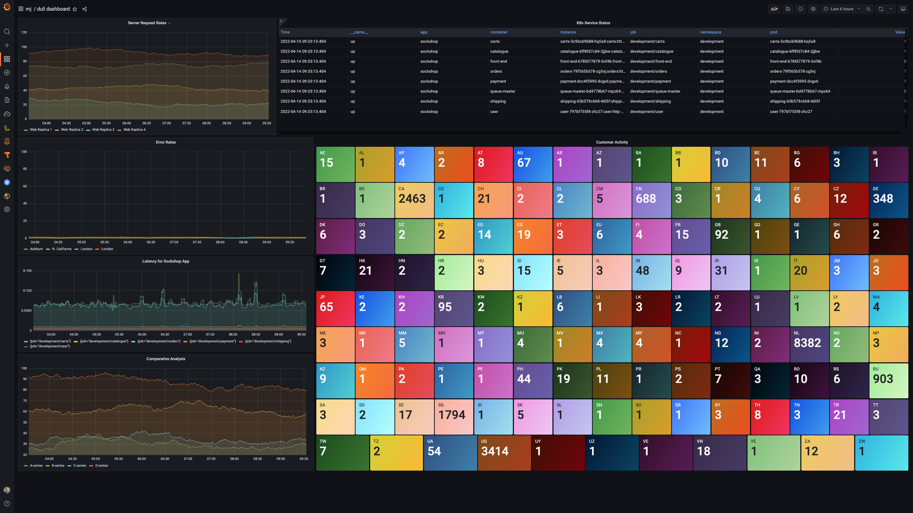

**Prerequisite**: We first need to import this dashboard.
Follow these steps to Import it:

1. Click the menu button (☰) at the top left, and then click on *Dashboards*.
2. On the Dashboards screen, click the *New* button and then click *Import*.
3. On the Import Dashboard screen, in the *Import via grafana.com* field, type in `16413` and then click *Load*.
4. You will be asked to choose three of your dashboard's data sources:
    - For TestData DB, choose `TestData DB`.
    - For Prometheus (Cloud), choose `Prometheus (Cloud)`.
    - For LokiNGINX, choose `Loki (Cloud)`.
    - Click on *Import*.

*While our existing dashboard already has useful information such as RED metrics - request rates, errors, and duration/latency - for our service as well as state information for the underlying Kubernetes pods and end-user activity from a geographic lens, our aim is to make the information on the dashboard easier to understand and more visually appealing.*

## Convert the 'Error Rates' panel from a time series to a stat panel

We will edit the Error Rates panel first.  We want to add context to what error rates are acceptable, in a danger zone, or are in violation of an internal Service Level Objective (SLO).

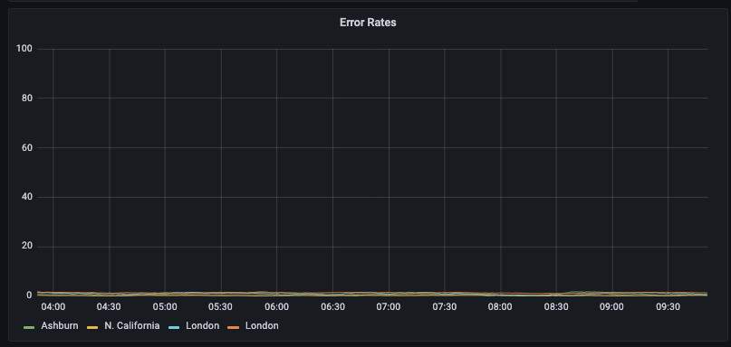

1. Edit the *Error Rates* panel (hover over the panel's title, click on the three vertical dots at the top right, and then click *Edit*)
2. Switch the Visualization Type from *Time Series* (or *Graph* in older versions of Grafana) to *Stat*
3. Under *Stat styles*:
    * Change Orientation from Auto to Horizontal.
    * Change Color Mode from Value to Background Gradient.
4. Expand the 'Value Mappings' section and then click *Add value mappings*:
    * If there is a default setting that null maps to N/A, click on the trash icon 🗑 to remove that default.
    * Click *Add a New Mapping* and then *Range*. Set range from 0 to 1 with Display Text of *OK*. Set color to Blue.
    * Click *Add a New Mapping* and then *Range*. Set range from 1 to 2 with Display Text of *Service Degraded*. Set color to Yellow.
    * Click *Add a New Mapping* and then *Range*. Set range from 2 to 100 with Display Text of *SLO Violation*. Set color to Orange.
    * Click on *Update*

    The value mapping settings should look like this:

    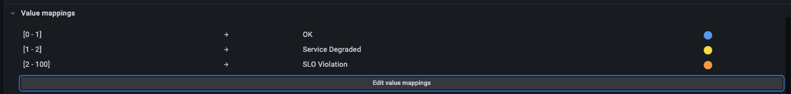

5.  Change the Panel Title to *SLO Status(Errors) per Data Center*
6.  Click on *Save Dashboard*
## Convert the 'K8s Service Status' panel from a table to a polystat panel
This table is showing us tons of information that we already know.  The original goal of this table was to show a state of 1 (UP) or 0 (DOWN) for each of our service containers.   Our new goal is to simplify the presentation of the information using a *polystat* panel.
1. Edit the *K8s Service Status* panel (hover over the panel's title, click the three vertical dots to show the context menu, and then click *Edit*)
2. Switch the Visualization Type from *Table* to *Polystat*

    You will notice that all of the rows have been aggregated into one average of all values.  To separate our data per container, change the query's *Format* from Table to Time Series.  In newer versions of the Grafana UI, this option is under *Options*.

    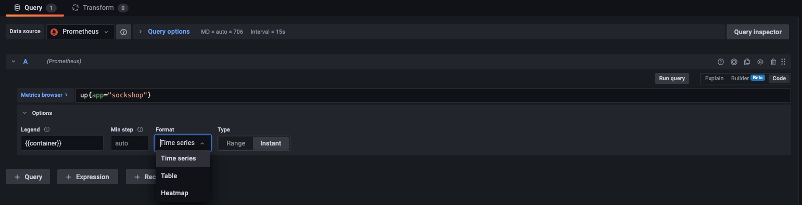

3. In the panel options, under the *Global* settings group, change Decimals from `2` to `0` as the *Instant* value will always be a 0 or 1.
4. Change the Polygon Border Color to Transparent.
5. Under Thresholds, click on *Add Threshold*:
    * For the default threshold, leave the value of 0, but change Color Mode from *ok* to *critical*.  Additionally, change the Color from Red to Orange.
    * Click *Add Threshold* to add a second threshold level. A new Threshold will appear.
    * For the second threshold, set value to 1 with Color Mode *ok*.  Additionally, change the Color from Green to Blue.
7. At the bottom of the options panel, click on *Add value mappings*.
    * Add a Value mapping, setting the value condition to 1, and the display text to *UP*.
    * Add a second Value mapping, condition 0 and display text *DOWN*.
8. Change the Font Family to 'Inter'.
9. Toggle Automate Font Color to the OFF position. This should render the text in black. Or, use the Font Color box to pick a color of your choice.
10. Click *Save Dashboard* to the leave the edit mode of that panel.
The panel should look similar to what is shown below:

    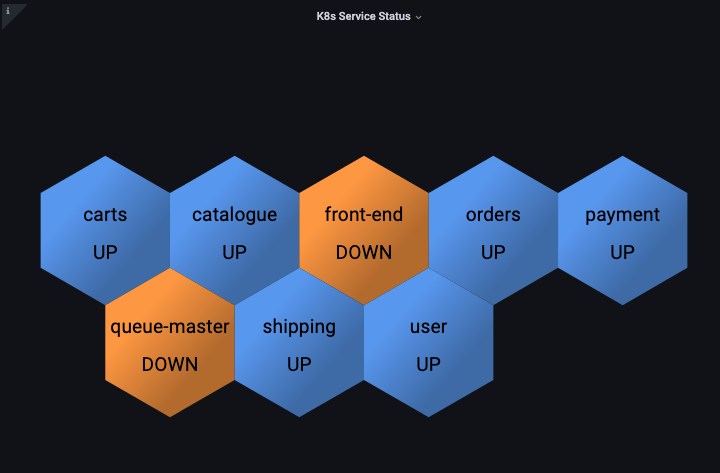

## Convert the 'Customer Activity' panel from a stat panel to a geomap
This one is a mess. I've been told that this data is from OSS [Loki](https://grafana.com/oss/loki/), our logging tool, and represents the number of hits coming from each geographic region. It is colorful, but I have a very difficult time interpreting the information.  Let's change the visualization to a map!
1. Edit the *Customer Activity* panel (hover over the panel's title, click the three vertical dots to show the context menu, and then click *Edit*)
2. Switch the Visualization Type from *Stat* to *Geomap*
3. In the *Search options* box in the top right, type `basemap layer`. The basemap layer option will be shown, and all other options will be hidden.
4. Under *Basemap layer*, change the Layer type to *ArcGIS MapServer* with a Server instance of *World Ocean*.
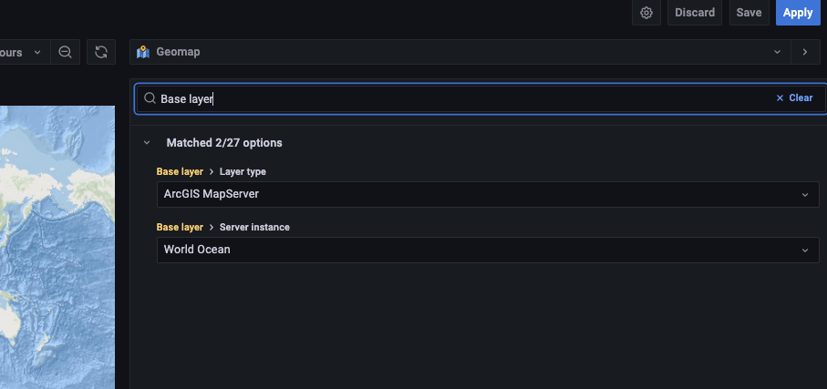
5. Click the '&#215; Clear' text in the Search bar to clear your search for "basemap layer".
6. CRITICAL! Since this is a point-in-time view, validate the *Query Type* of the query is __Instant__ and not Range.
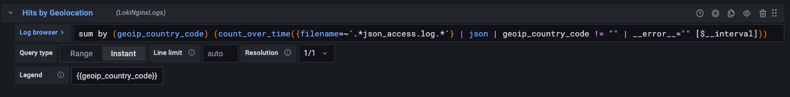
7. We want to add markers on the map.  Again using the *Search options* in the top right, find *Map layer* and click on Layer 1 *markers*. We want a lookup of the country by our *geoip_country_code* field.
8. To do this, under *Location Mode*, click *Lookup* and then under Lookup Field, choose *geoip_country_code*.  You should now see data on your map. But we're not done!
9. Under Styles, change Size from *Fixed Value* to *Value #Hits by geolocation*, setting the min to **10** and the max to **50**.
10. Change Symbol from Circles to Star. Do this by selecting the circle.svg text, selecting Star and hitting 'Select'.
11. Set *Fill opacity* to **1**.
11. Change Color from *Fixed color* to *Value #Hits by geolocation*.
12. The colors of blue and orange seem to blend in a bit much on the map, so we need to make them stand out a bit more. Using the *Search options* box in the top right, enter `thresholds`. Change the base color to Dark Purple by clicking on the orange circle, then clicking on dark purple, and then click outside of that popup window.
14. For a threshold of 10, change the color to dark Orange using the same method as above.
15. Delete the 3rd threshold value of 20 by clicking on its garbage can icon.
16. Click Save Dashboard to the leave edit mode of that Panel.
## Update the 'Latency for Sockshop App' panel
Since this service latency graph is viewed by dozens of people, we know statistically that at least 2 people viewing this graph are colorblind.  That said, the Product owner of Sockshop called the colors 'uninspiring'.  You also notice that the legend is rough around the edges.
1. Edit the *Latency for Sockshop App* panel (hover over the panel's title, click the three vertical dots to show the context menu, and then click *Edit*)
2. Switch the Visualization Type to *Time Series*, if it isn't already.
3. Let's fix the legend first:
    * Under the query on the left, in the Options panel, change the Legend type from Verbose to *Custom* and enter `{{ job }}`.  You will notice that the name of the job is displayed at the bottom of the graph, instead of the raw key/value pair.  But we still don't like the fact that the namespace of _development_ still appears.  So, let's use a _transformation_ to rename our fields.
    * Click on _Transform_ and then _Rename fields by Regex_ (use the 'Add transformation' search to find it).  For match, let's do 2 string captures - before and after the */*.
    * For match, type in `.+/(.+)`
    * For the _Replace_ field, type in `$1`
4. Someone else said this graph, denoted in seconds, would be easier to understand if it were in milliseconds.
    * Let's change the query on the left hand side by adding *\* 1000* to the end of the query
    * Add a unit to the y-axis: Under the panel's search options (top right), type in _Unit_.  For the unit, use _Time / milliseconds (ms)_.
5. We now want to make it easier for our colorblind colleagues to read.
    * For all lines in the graph: Use the  *Graph Styles*, choose a Line Width of 2 and a Fill opacity of 0

        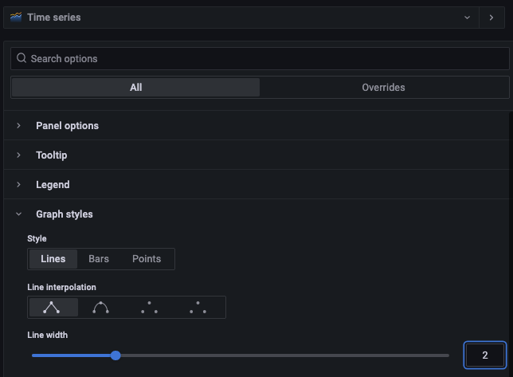

    * Let's make dataset _user_ a dashed line.  In the upper right, click on *Overrides* and _Add field override_. Then, choose "Fields with Name" _user_. Next, add override property _Graph styles > Line style_. Change from Solid to *Dash*. Keep *10,10* as the *line,space* setting.
    * We will make field _payment_ a dashed line as well. Again, click on _Add field override_, choosing "Fields with Name" _payment_. Next, add override property _Graph styles > Line style_. Change from Solid to *Dash*. Use a *5,10* dash line style.
    * Let's make dataset _catalogue_ a dashed line. Add an override for Fields with name _catalogue_, adding a Line Style override. For the dash pattern, we want to see long-short-short, and so to do this, we choose *30,3,3*, the last item in the dropdown.
    * Choose field with name _carts_ and Add override property.  In search, find _Graph styles > Line style_. Change from Solid to *Dots* and keep the *0,10* *line,space* setting.
    * We will keep _orders_ as-is.
6. Click *Save Dashboard*. Below is what your panel should look like:

    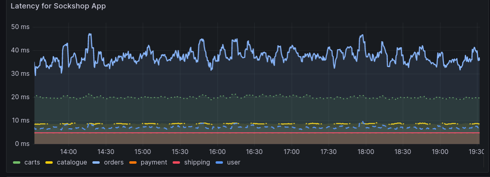

7. One more fix!  We notice that the two blue colors are just too similar, and we want to make it obvious.  So, right from the dashboard, we click on the blue line associated with _user_ in the legend, and a set of default colors appear.  Choose Purple.
8. Save the dashboard.
## Convert the 'Server Request Rates' panel from a time series to a bar gauge panel
Like our first panel, we want context to understand what good looks like.  Knowing our internal data patterns, we want to avoid service overload conditions where end-user performance can be affected.
1. Edit the *Server Request Rates* panel (hover over the panel's title, click the three vertical dots to show the context menu, and then click *Edit*)
2. Change the Panel Title to *Server Request Rates per Second* (i.e. add "per Second" for clarity)
3. Switch the Visualization Type from *Time Series* to *Bar Gauge*
4. Under *Bar Gauge*:
    * Change Orientation (Layout Orientation) from Auto to Horizontal.
    * Change Display Mode from *Gradient* to *Retro LCD*
5. Under Thresholds (At the bottom of the menu panel on the right):
    * Change the base color from Green to Blue
    * Change the 2nd color from Red to Yellow and the threshold level from 80 to 45.
    * Add a third threshold level, 55.  Set color to Orange.
    * Select Save Dashboard to apply your panel settings.

Below is what your panel should look like:

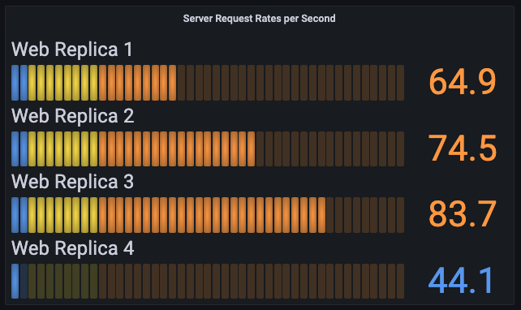

## Add existing library panels
Remembering that someone saved some valuable service KPI panels to your Panel Library, adding them will give our users a better picture of how our service is being delivered.

1. From your dashboard, click the _Add_ button, click on the _Plus_ button to create a new panel. Find the newly-created panel at the bottom of your dashboard, and then click _Use library panel_.
   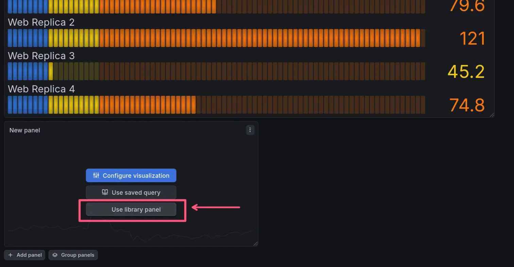


2. Search for the word "Apdex" and choose Panel, "Service APDEX".

    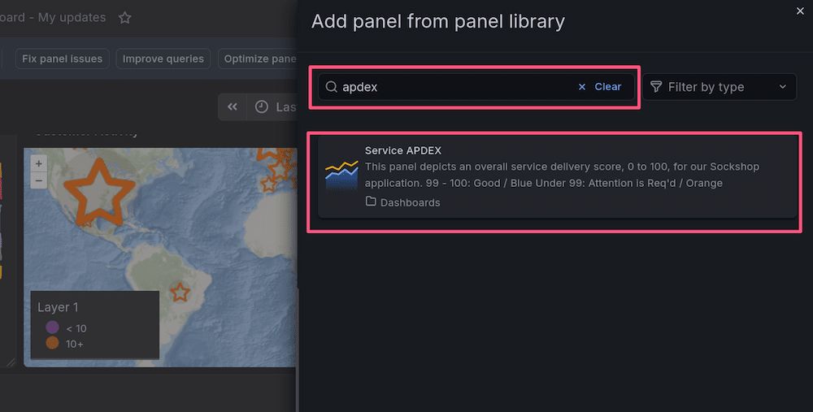

    ⚠️ **NOTE:** This Library Panel is created from a test data source, so it will initially appear blank. Continue with the next steps to add the two other panels.

2. Repeat this process, searching for "Score" and choosing panel, "Infrastructure - Error Score".
3. Repeat this process a third time, searching for "sock" and choosing panel, "Latency Profile, Sockshop Application".
5. Critical - Save your dashboard as you've done some fine work thus far! Then you can reload the dashboard to see the new panels.

After adding these panels, you notice at the top they all have a link icon. These *Panel drilldown* links go to another, more detailed dashboard... score!  That will save us a ton of time building the detailed service view.

To import that drilldown dashboard (Called `Sockshop Performance`):

1. Click the menu button (☰) at the top left, and then click on *Dashboards*.
2. On the Dashboards screen, click the *New* button and then click *Import dashboard*.
2. In the Import via grafana.com field, type in `16416` and then click *Load*.
3. You will be asked to choose your dashboard's data source:
    - For Prometheus (Cloud), choose `Prometheus (Cloud)`.
4. Click on *Import*.

However, you want to add a similar drilldown to the _SLO Status (Errors) per Data Center_ panel (i.e. the renamed "Error Rates" panel) just in case users don't see the panel links.
1. Open the "dull dashboard" (find it in Home &rarr; Dashboards).
2. Edit the _SLO Status (Errors) per Data Center_ panel and find the category *Data Links* (3rd from the bottom - _not_ Panel Links).
3. Click _Add Link_ and add the following:
    * For Title, type in _Sockshop Service Details_.
    * For URL, paste in `/d/b2kdXLwnz/sockshop-performance?orgId=1`
    * Select _Open in new tab_ and click *Save*.
4. Click *Save Dashboard* to return to the Dashboard and then click the *Save* icon to save your changes.
5. Now that you have saved your work, click anywhere on the SLO Status (Errors) graph to validate it drills into that other detailed dashboard.

## Add our company logo
For a bit of flair, we'd like to add our company logo.  To do so:
1. In the (formerly) dull dashboard, click on the _Add_ button, then click on the _Plus_ button to create a new panel.
2. Click _Edit visualization_.
3. On the right hand side, click _Change_ to bring up the visualization menu. Make sure that _All visualizations_ is selected, then search for 'Text'. Choose a *Text* panel.
4. For _mode_ in the bottom right, switch from Markdown to HTML.
5. Remove the default text and paste in the following HTML:

    ```html
    <center></center>
    ```

6. Remove the Panel Title, Click on _Transparent Background_ and click *Save Dashboard*.
7. Size the panel appropriately.

## Arrange and group our panels
Finally, we need to arrange our panels so that the most important graphs are in that Z pattern, spaced appropriately, and properly sized. 

We'll also group our panels into three tabs, each answering a single question: *How healthy is the service?*, *Is the platform up?*, and *How does it feel to our users?* Showcasing tabs this way keeps each grouping tight and gives our viewers a clear mental model.

You can drag a panel into a tab by clicking on it, dragging it to the new tab, and then dropping it on the canvas, like this:

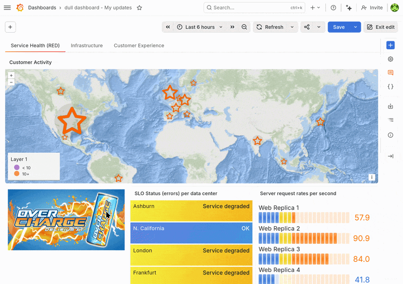

1. First, let's configure this dashboard to group into tabs. Scroll to the bottom of the dashboard and click on the _Group panels_ button, selecting _Group into tab_. This will place all panels into a single tab.
2. Click on the tab ("New tab") to select it, and use the properties panel on the right to change its title to *Service Health (RED)*. Set its *Layout* type to *Custom*. This tab holds all three RED signals — **R**ate, **E**rrors, and **D**uration — so they can be read together.
3. Hover over the row of tabs and click on the button _New tab_. With the new tab selected, use the properties panel on the right to set its title to *Infrastructure*. Leave its *Layout* type to *Auto*, and set the *Max columns* to **2**.
4. Click _New tab_ once more. Set this third tab's title to *Customer Experience*, leaving its *Layout* type as *Auto* with *Max columns* set to **2**.
5. Now click and drag each panel into the correct tab.

   Into the *Infrastructure* tab:
   * K8s Service Status
   * Infrastructure - Error Score

   Into the *Customer Experience* tab:
   * Customer Activity
   * Service Apdex

6. Everything else stays on the *Service Health (RED)* tab. Arrange the top row left-to-right so the eye lands on the most important panel first — the top-left corner is where a viewer's gaze naturally starts:
   - SLO Status (Errors) per Data Center (top-left — this is the panel we most want people to see)
   - Server Request Rates per Second (center)
   - Company logo (top-right, kept small)

   The second row should have:
    - Latency for Sockshop App panel
    - side-by-side with the Latency quantiles panel.
   Keeping both latency panels together puts the full Duration story in one place.

After arranging your panels, your dashboard should look something similar to this:

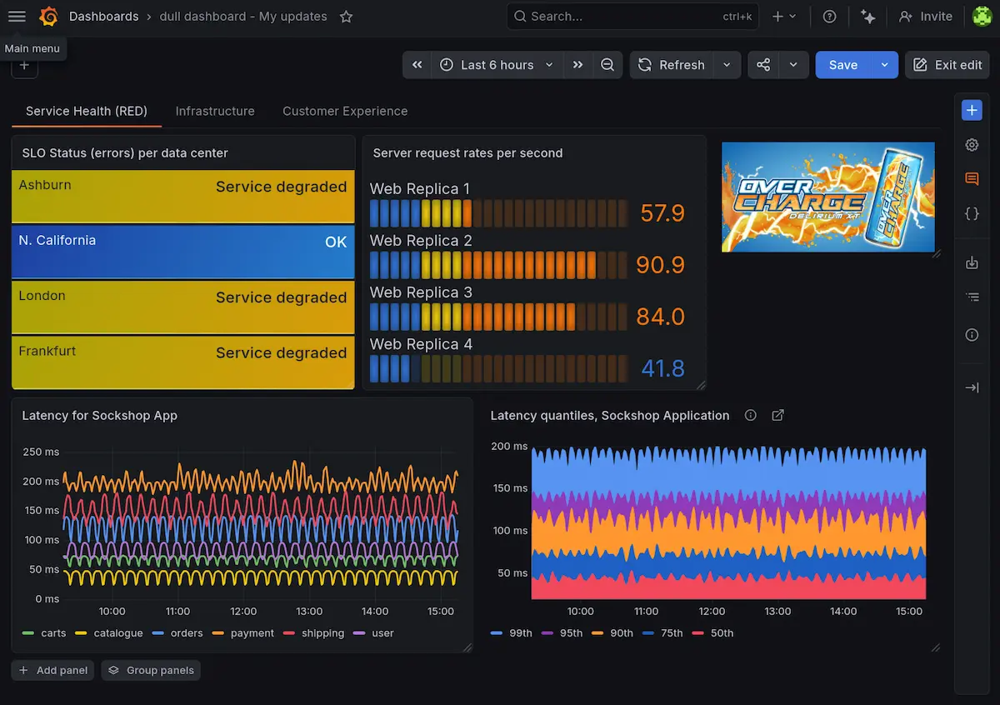

If you didn't quite finish but would like a working copy of our result you can import the dashboard:
Steps to Import:
1. Go to https://github.com/grafana/extreme-dashboard-makeover-breakouts/tree/main
2. Find the file `dashboards/completed_dashboard.json` and download it.
3. In Grafana, click the menu button (☰) at the top left, and then click on *Dashboards*.
4. On the Dashboards screen, click the *New* button and then click *Import*.
5. Upload the downloaded file.
6. You will be asked to choose three of your dashboard's data sources:
    * For TestData DB, choose `TestData DB`.
    * For Prometheus (Cloud), choose `Prometheus (Cloud)`.
    * For LokiNginxLogs, choose `Loki (Cloud)`.
    * Click on *Import*.
