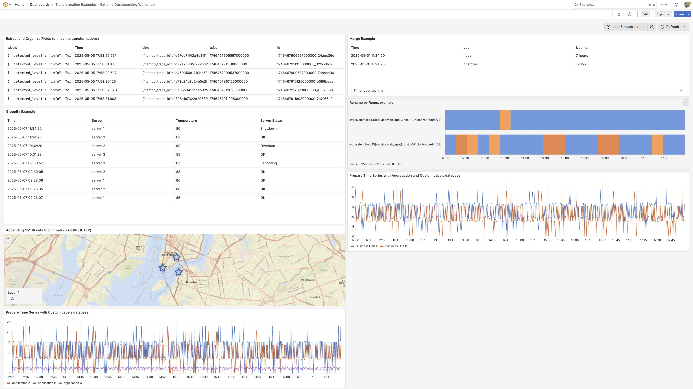

## Transformations

*Prerequisite*: We first need to import this dashboard. Follow these steps to Import it:

1. Click the menu button (☰) at the top left, and then click on Dashboards.
2. On the Dashboards screen, click the New button and then click Import.
3. On the Import Dashboard screen, in the Import via grafana.com field, type in `23384` and then click Load.

4. You will be asked to choose three of your dashboard's data sources:
  a. For TestData DB, choose *TestData DB*.
  b. For Prometheus (Cloud), choose *Prometheus (Cloud)*.
  c. For LokiNginxLogs, choose *LokiNginxLogs*.
  d. Click on *Import*.

**Panel 1: Extract and Organize Fields**
One common use of the `Extract Fields` use case is for when you want to visualize logs as a set of filterable tables. Extract fields will automatically parse your JSON logs (among other log formats) into structured columns.

Use this transformation to select a source of data and extract content from it in different formats. This transformation has the following fields:

  - Source - Select the field for the source of data.
  - Format - Choose one of the following:
    - JSON - Parse JSON content from the source.
    - Key+value pairs - Parse content in the format 'a=b' or 'c:d' from the source.
    - RegExp - Parse content using a regular expression with named capturing group(s) like /(?<NewField>.*)/. Example of a regular expression
    - Auto - Discover fields automatically.
  - Replace All Fields - (Optional) Select this option to hide all other fields and display only your calculated field in the visualization.
  - Keep Time - (Optional) Available only if Replace All Fields is true. Keeps the time field in the output.

Go to the [transformation documentation](https://grafana.com/docs/grafana/latest/panels-visualizations/query-transform-data/transform-data/?utm_source=grafana#extract-fields) for more general documentation.

Often coupled with the `Extract Fields` transform is [Organize Fields](https://grafana.com/docs/grafana/latest/panels-visualizations/query-transform-data/transform-data/?utm_source=grafana#organize-fields-by-name). Grafana displays a list of fields returned by the query, allowing you to perform the following actions:

- Change field order - Hover over a field, and when your cursor turns into a hand, drag the field to its new position.
- Hide or show a field - Use the eye icon next to the field name to toggle the visibility of a specific field.
- Rename fields - Type a new name in the “Rename ” box to customize field names.

