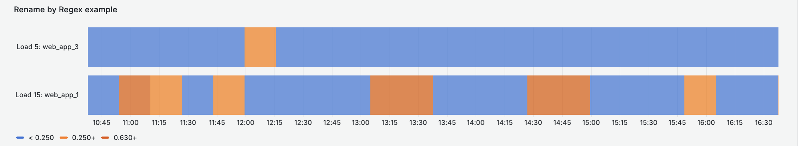

# Transformations
The following sections describe seven use cases where Grafana Transformations are used.

## Prerequisite

We first need to import this dashboard. Follow these steps to Import it:

1. Click the menu button (☰) at the top left, and then click on Dashboards.
2. On the Dashboards screen, click the New button and then click Import.
3. On the Import Dashboard screen, in the Import via grafana.com field, type in `23384` and then click Load.

4. You will be asked to choose three of your dashboard's data sources:
    - For TestData DB, choose *TestData DB*.
    - For Prometheus (Cloud), choose *Prometheus (Cloud)*.
    - For LokiNginxLogs, choose *LokiNginxLogs*.
    - Click on *Import*.

For each of the panels:
- Hover over the panel's title, click on the three vertical dots at the top right, and then click **Edit**.
- Go to the transformations tab as seen below.

- Click on the `Disable Transformation` button for each Transformation to enable and see how it works.  The button is highlighted below. 

## Top Left Panel: Extract and Organize Fields
Use Case: Visualize logs as a table with filter columns for easy data search.

Use the `Extract Fields` transformation to select a source of data and extract content from it in different formats. This transformation has the following fields:

  - Source - Select the field for the source of data.
  - Format - Choose one of the following:
    - JSON - Parse JSON content from the source.
    - Key+value pairs - Parse content in the format 'a=b' or 'c:d' from the source.
    - RegExp - Parse content using a regular expression with named capturing group(s) like /(?<NewField>.*)/. Example of a regular expression
    - Auto - Discover fields automatically.
  - Replace All Fields - (Optional) Select this option to hide all other fields and display only your calculated field in the visualization.
  - Keep Time - (Optional) Available only if Replace All Fields is true. Keeps the time field in the output.

Go to the [extract fields documentation](https://grafana.com/docs/grafana/latest/panels-visualizations/query-transform-data/transform-data/?utm_source=grafana#extract-fields) for more details.

Often coupled with the `Extract Fields` transform is [Organize Fields](https://grafana.com/docs/grafana/latest/panels-visualizations/query-transform-data/transform-data/?utm_source=grafana#organize-fields-by-name). Grafana displays a list of fields returned by the query, allowing you to perform the following actions:

- Change field order - Hover over a field, and when your cursor turns into a hand, drag the field to its new position.
- Hide or show a field - Use the eye icon next to the field name to toggle the visibility of a specific field.
- Rename fields - Type a new name in the “Rename ” box to customize field names.

## Middle Left Panel: GroupBy
Use Case: Simplify (aggregate) the view of a dataset

The `GroupBy` transformation has two steps. First, you specify one or multiple fields to group the data by. This will group all the same values of those fields together, as if you sorted them. For instance, here we group by the Server ID field to get all rows with the same value of Server ID grouped together.

After choosing which field you want to group your data by, you add various calculations on the other fields, and apply the aggregation calculation to each group of rows. For instance, we could want to calculate the average CPU temperature for each of those servers. So, we can add the *mean* calculation applied on the Temperature field.  We may also want to know the current state of the server and so we would choose *Last* to get the most recent value per Server ID.

Go to the [group by documentation](https://grafana.com/docs/grafana/latest/panels-visualizations/query-transform-data/transform-data/#group-by) for more details.

## Lower Left Panel: Join by Field
Use Case: Put time series data (latest values) on a map.
`Join by Field` is commonly used to perform SQL-like table joins between two separate queries.  In this example, we have two queries:
1. Prometheus data (web requests) for 3 services
2. Geo-coordinates for those same 3 services

For us to join Prometheus time series data with a second table, the format of our Prometheus data needs to be set to `Table` as seen in the picture below.

Looking at the transformation, we are performing an outer join on a common field called "service".
Also note that to have this "zoomed in" map view, we first (1) zoom into the datapoints using the +/- in the top left of the map; and then (2) we click on "Use current map settings" for the map panel to remember the amount of zoom and which specific geocoordinates to use for map centering.

Go to the [join by field documentation](https://grafana.com/docs/grafana/latest/panels-visualizations/query-transform-data/transform-data/#join-by-field) for more details.

## Bottom Left Panel: Merge + Prepare Time Series
Use Case: Change label names in bulk with an external table lookup
While our example here is using a simple text file as our second data source, your second data source could be an Oracle (or other ODBC-based) table.

There are two transformations necessary to change label names in bulk.  The first is a table `Merge`. In order to leverage the Merge transformation, our time series data format needs to be set to `Table` as seen in the picture below. That said, we still want the query type to be set to `Range` as we eventually want the data to be presented as a range of time series data.

The second transformation is called `Prepare Time Series`. This takes the merged tables and converts them back from a table into a time series format.

Go to the [prepare time series documentation](https://grafana.com/docs/grafana/latest/panels-visualizations/query-transform-data/transform-data/#prepare-time-series) for more  details.

## Top Right Panel: Merge and Convert Field Type
Use Case: Unify two datasets with a common label
This is similar to the Merge + Prepare Time Series use case above but in this case, we choose not to convert the data back into a timeseries format.

Below is what the data looks like after the merge.  

Note that we are also using the transformation, `Convert Field Type` for **Up** from metric type "time" to "number".  For the Uptime metric, we then use an override on the `Unit` field, setting the Unit to `milliseconds (ms)`.

## Middle Right Panel: Rename by Regex
Use Case: Make graph labels more human readable

In this example, we take the out-of-box naming convention generated by the Datadog plugin and convert them in bulk to something more human readable.  To do so, we use Regex.  If you are not familiar with Regex, a useful web site to test regex is [regex101.com](http://www.regex101.com). 

In the screen capture below, we have a text pattern that is common amongst the two fields.  Our two fields are below:
avg:system.load.5{service:web_app_3,host:i-071cbc7c4fed94f78}
max:system.load.15{service:web_app_1,host:i-071cbc7c4use94f33}

In regex, we can match on both text patterns by using a set of `capture groups` - denoted by (.*) - where the text is variable.  Our pattern match with four capture groups would then be:

(.*).system.load.(.*){service:(.*),host:(.*)}

In our case, we perhaps do not care whether the load is avg or max, and perhaps we do not care about the EC2 instance host ID of i071cbcxyz.  Therefore, if we only care about whether the metric is a "load.5" or a "load.15" value, and whether the service is "web_app_1" or "web_app_3" we could use the following replace value: `Load $2: $3`.  The result of the rename by regex is below.

Go to the [rename by regex documentation](https://grafana.com/docs/grafana/latest/panels-visualizations/query-transform-data/transform-data/#rename-by-regex) for more  details.

## Bottom Right Panel: Prepare Time Series with Aggregation and Custom Labels database
Use Case: Aggregate time series data with a custom labels database

This example is very similar to the Bottom Left, Merge + Prepare Time Series, but in this case (a) we have two of the same label values, and (b) we would like to add the two time series together where the newlabel value is "Business Unit A".

In this case, we need three transformations.
1. `Merge` to merge the two tables of data together
2. `Group By` to group by timestamp as well as by the newlabel, and then **Total** (ie add) the values for those metadata/label groupings.
3. `Prepare time series` to change the Prometheus data back into a time series format.
The result of these three transformations is below.

 
