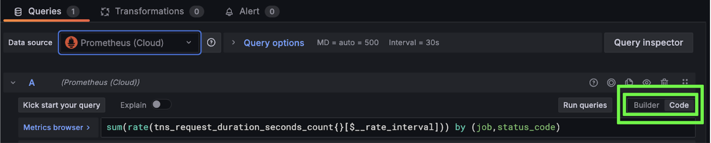
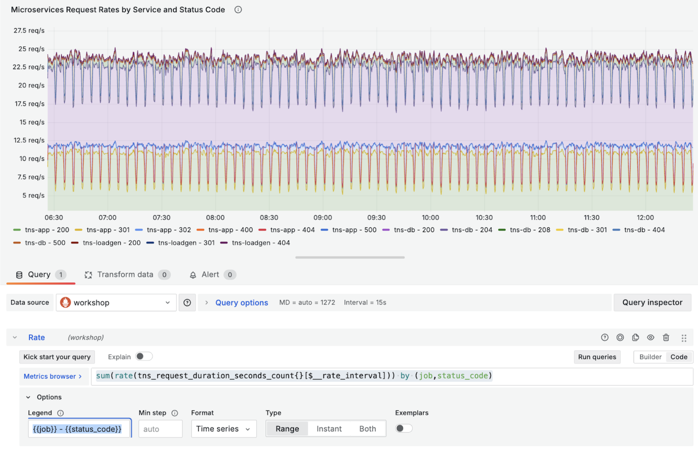
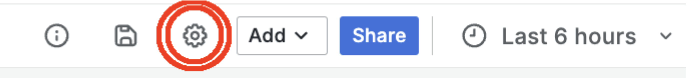
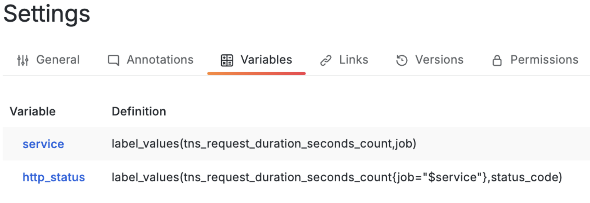
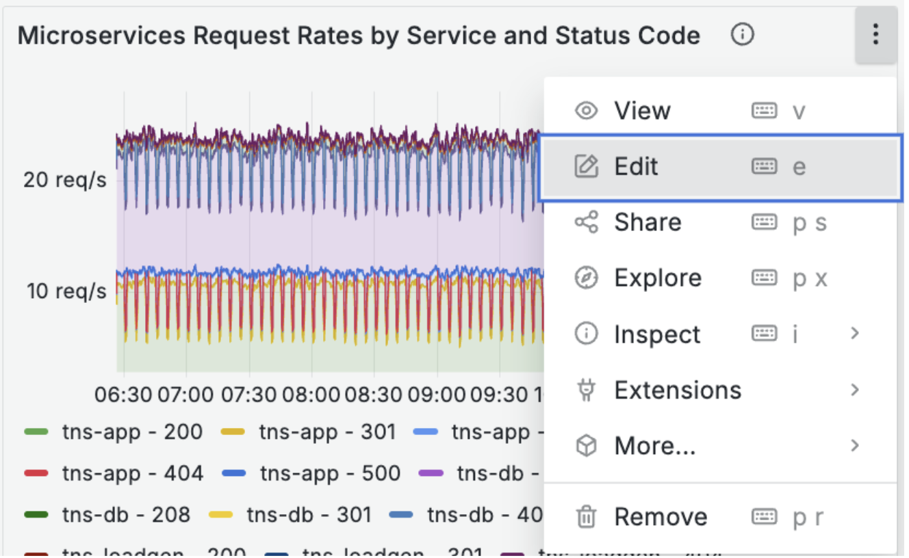
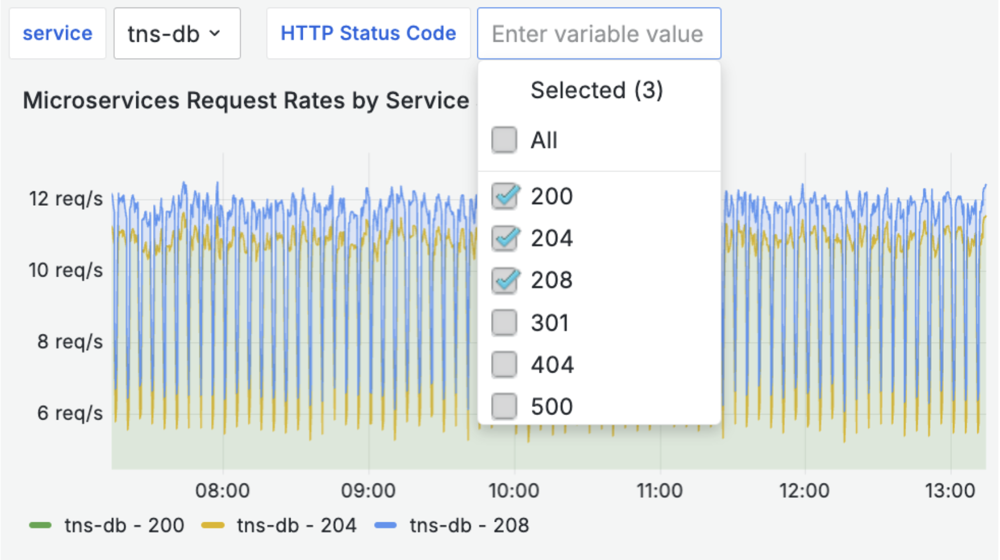

# Panels Controlled by Nested Variables

To make dashboards more dynamic and scalable, it is common practice to leverage variables in your dashboards.  In this example, we are going to create a variable called “service” so that we can filter our data on services of interest.  Then, we want to see a graph that shows request rates of only specific HTTP status codes for a particular service.

## Create our Prometheus-based graph
We will make a graph showing all data first.

1. Add a new panel by clicking on **Add … Visualization**.
2. Keep Visualization Type **Time Series**.
3. Name the Panel > Title, `Microservices Request Rates by Service and Status Code`
4. Choose Prometheus Data Source, Prometheus (Cloud).
5. Use the formula below, switching from `Builder` mode to `Code` mode.  This Prometheus query provides request rates by job (aka “service”) and status code.

`sum(rate(tns_request_duration_seconds_count{}[$__rate_interval])) by (job,status_code)`

6. In your query’s **options**, set the **legend** to: 
`{{job}} - {{status_code}}`
7. The interim result should look like this below. After you are done, click Apply.

## Create our Prometheus-based nested variables
Now, we create our dashboard variables to control this panel.
1. Click on the **Gear** icon in the top right of your dashboard, choose the **Variables** tab, and **Add Variable**.

2. Configure the first variable named “service”:
  a. Select variable type: *Query*
  b. General > Name: *service*
  c. General > Label: *Service*
  d. Query options > Data source: *Prometheus (Cloud)*
  e. Query options > Query > Query type: *Label Values*.  We want to extract the values for the label named `job`.
  f. Query options > Query > **Label**: `job`
  g. Query options > Query > **Metric**: *tns_request_duration_seconds_count*.  We could have chosen any tns_* metric that has data for our 3 services.
  h. Query options > Query > **Label filters**: (leave this blank)
  i. Selection options > Multi-value: (leave unchecked)
  j. Selection options > Include All option: leave unchecked
  k. Click **Run Query**.  It should return `tns-app`, `tns-db`, and `tns-loadgen`.
  l. Click **Apply**.
3. Configure the second variable, “http status”, who relies upon the value of the $service variable.
  a. Click on **+ New variable**.
  b. Select variable type: *Query*
  c. General > Name: *http_status*
  d. General > Label: *HTTP Status Code*
  e. Query options > Data source: *Prometheus (Cloud)*
  f. Query options > Query > Query type: *Label Values*.  We want to extract the values for the label named `job`.
  g. Query options > Query > **Label**: *status_code*
  h. Query options > Query > **Metric**: *tns_request_duration_seconds_count*
  i. Query options > Query > **Label filters**: `job **=~** $service`
  j. Selection options > Multi-value: check
  k. Selection options > Include All option: check
  l. Click **Run Query**.  It should return a few status codes.
  m. Click Apply.
After steps 2 & 3, your dashboard variables should look like this below:

## Modify our Prometheus-based graph
We now need to modify our graph’s query to take advantage of our two new variables.
1. In the upper right corner of our graph panel, click on the 3 dots and then Edit.

2. In the formula, we will add the two metadata fields inside the curly brackets {}.  We will use `=~` instead of `=` because we want to be able to choose more than one service or http_status at a time.  Here is an updated formula:

`sum(rate(tns_request_duration_seconds_count{job=~"$service",status_code=~"$http_status"}[$__rate_interval])) by (job,status_code)`

Click **Apply** to update your panel.  The result should look like this below.

